\title{
Unsupervised Zero-Shot Reinforcement Learning via Functional Reward Encodings
}

\author{
Kevin Frans ${ }^{1}$ Seohong Park ${ }^{1}$ Pieter Abbeel ${ }^{1}$ Sergey Levine ${ }^{1}$ \\ ${ }^{1}$ University of California, Berkeley \\ kvfrans@berkeley.edu
}

\begin{abstract}
Can we pre-train a generalist agent from a large amount of unlabeled offline trajectories such that it can be immediately adapted to any new downstream tasks in a zero-shot manner? In this work, we present a functional reward encoding (FRE) as a general, scalable solution to this zero-shot $R L$ problem. Our main idea is to learn functional representations of any arbitrary tasks by encoding their state-reward samples using a transformerbased variational auto-encoder. This functional encoding not only enables the pre-training of an agent from a wide diversity of general unsupervised reward functions, but also provides a way to solve any new downstream tasks in a zeroshot manner, given a small number of rewardannotated samples. We empirically show that FRE agents trained on diverse random unsupervised reward functions can generalize to solve novel tasks in a range of simulated robotic benchmarks, often outperforming previous zero-shot RL and offline RL methods. Code for this project is provided at: github.com/kvfrans/fre.
\end{abstract}

\section*{1. Introduction}

A useful agent is one that can accomplish many objectives in a domain. Household robots are more beneficial the more chores they can complete; self-driving cars the more places they can reach. Building upon this premise, we draw inspiration from the recent success of unsupervised learning in language (Brown et al., 2020) and vision (Kirillov et al., 2023), which has shown that a single generalist model trained on Internet-scale data can immediately solve a wide array of tasks without further training or fine-tuning. Motivated by these successes, we study an analogous way to train a gen-

\footnotetext{
${ }^{1}$ University of California, Berkeley. Correspondence to: Kevin Frans < kvfrans@berkeley.edu>.

Proceedings of the $41^{\text {st }}$ International Conference on Machine Learning, Vienna, Austria. PMLR 235, 2024. Copyright 2024 by the author(s).
}
eralist agent from unlabeled offline data such that it can immediately solve new user-specified tasks in a without training. This has been referred to as the zero-shot reinforcement learning ( $R L$ ) problem (Touati et al., 2022). From this data, the hard challenge is how to discover, without labels, a task representation that is robust to downstream objectives - in essence, bypassing the need for a human to specify wellshaped reward functions before training.
In this work, we aim to provide a simple, scalable approach to the zero-shot RL problem. Our key insight is to directly learn a latent representation that can represent any arbitrary reward functions based on their samples of state-reward pairs. We refer to this idea as Functional Reward Encoding (FRE). This is in contrast to previous works in zeroshot RL or multi-task RL that employ domain-specific task representations (Barreto et al., 2017; Li et al., 2020a) or highly restrictive linear reward structures (Borsa et al., 2018; Touati \& Ollivier, 2021; Touati et al., 2022). By directly encoding reward functions into a latent space, we can pretrain a multi-task agent with a host of unsupervised reward functions of arbitrary diversity, and quickly identify the representations corresponding to new test tasks given a small number of reward-annotated samples.

Training an FRE requries utilizing a prior distribution over reward functions. When no information about downstream tasks is available, we must define a prior that broadly spans possible objectives in a domain-agnostic manner. In our experiments, we show that a mixture of random unsupervised reward functions, such as goal-reaching and random MLP rewards, are a reasonable choice for the reward prior. We optimize an FRE-conditioned policy towards all rewards within this space. In this way, approximate solutions to many downstream tasks have already been learned, and the zero-shot RL problem reduces to simply locating the FRE encoding for the task, which the learned encoder accomplishes.

Thus, our framework presents a simple yet scalable method for training zero-shot RL agents in an unsupervised manner, as shown in Figure 1. The main idea is to (1) train an FRE network over random unsupervised reward functions, then (2) optimize a generalist FRE-conditioned policy towards
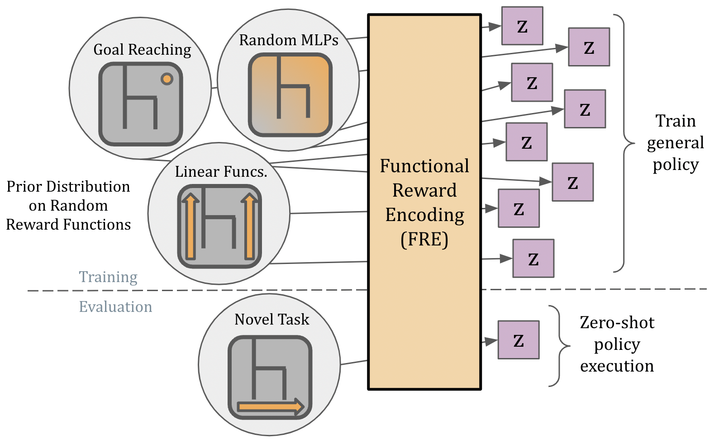

Figure 1. FRE discovers latent representations over random unsupervised reward functions. At evaluation, user-given downstream objectives can be encoded into the latent space to enable zero-shot policy execution. FRE utilizes simple building blocks and is a data-scalable way to learn general capabilities from unlabeled offline trajectory data.
maximizing said rewards, after which (3) novel tasks can be solved by simply encoding samples of their reward functions, such that the FRE agent can immediately act without further training.

We verify the efficacy of our method through experiments on standard offline RL domains. We demonstrate that without any finetuning, FRE policies can solve tasks involving locomotion of an eight-DoF robot through a maze or manipulation of a robotic arm in a kitchen scene, and can learn diverse, useful policies from the unsupervised ExORL dataset consisting of non-expert trajectories. FRE-based agents match or outperform state-of-the-art offline RL methods. Prior methods display competitive performance on either goal-reaching or structured rewards, but not both; FRE is the first method to consistently solve tasks across the board.

\section*{2. Related Work}

Task-conditioned reinforcement learning. Our work builds off the field of multi-task RL (Caruana, 1997), where a single generalist policy is conditioned on a task description. Universal Value Functions (Schaul et al., 2015) pro-
vide a general framework for value functions conditioned on task descriptions, which are sometimes referred to as 'metadata' (Sodhani et al., 2021) or contextual MDPs (Hallak et al., 2015). Previous multi-task RL methods typically assume a parameterized family of tasks, specifying tasks by manually designed task parameters (Barreto et al., 2017), symbolic annotations (Andreas et al., 2017), or language embeddings (Silva et al., 2021; Shridhar et al., 2023). Unlike these works, we bypass the need for domain-specific task-conditioning entirely. By instead learning a functional latent encoding over unsupervised rewards, we can express and generalize to any arbitrary reward functions, without assuming a parameterized task family.

Zero-shot reinforcement learning with successor features. Previous works have presented successor feature (SF)-based solutions to the zero-shot RL problem (Dayan, 1993; Barreto et al., 2017; Borsa et al., 2018; Chen et al., 2023), where they learn universal value functions based on a linear combination of pre-defined or learned state features. Approaches such as the forward-backward method (Touati \& Ollivier, 2021; Touati et al., 2022) extend the SF framework by avoiding the need to train state features separately. However, these SF-based methods share a limitation in that they can only learn value functions in the linear span of state features. In contrast, we do not make any assumptions about the task structure, allowing the policy to learn any reward functions based on our functional reward embedding. We show that this not only makes our policy universal, but also leads to better empirical performance than these SF methods in our experiments.

Goal-conditioned reinforcement learning. Goalconditioned RL (Kaelbling, 1993) provides another way to train a multi-task policy, whose aim is to learn to reach any goal states in the lowest amount of time. There have been proposed a variety of methods for online (Andrychowicz et al., 2017; Levy et al., 2017; Nair et al., 2018; Savinov et al., 2018; Fang et al., 2018; Durugkar et al., 2021; Agarwal et al., 2023) and offline (Chebotar et al., 2021; Yang et al., 2022; Eysenbach et al., 2022; Li et al., 2022; Wang et al., 2023; Park et al., 2023a) goal-conditioned RL. In this work, we consider goal-conditioned RL as a subset of the full zero-shot RL problem: we train our policy with a more general set of unsupervised reward families that include goal-conditioned tasks. As a result, our policy learns much more diverse behaviors than goal-reaching, which is crucial for solving general reward functions at test time, as we will show in our experiments.

Unsupervised skill learning. Our method is related to previous online and offline unsupervised skill learning methods, as we also train a multi-task policy from offline data in an unsupervised manner. Online unsupervised skill discovery methods train skill policies by maximizing various in-
trinsic rewards (Eysenbach et al., 2018; Sharma et al., 2019; Strouse et al., 2021; Laskin et al., 2022; Park et al., 2023b). Offline skill learning methods train multi-task policies via behavioral cloning on trajectory chunks (Ajay et al., 2020; Pertsch et al., 2021) or offline RL with random reward functions (Hu et al., 2023). These methods, however, either assume high-quality demonstrations or do not provide an efficient mechanism to adapt to tasks at test time. In contrast, our approach trains diverse policies that are optimal for a wide array of reward functions, while jointly learning a functional reward encoding that enables zero-shot test-time adaptation.

Offline Meta-RL. Finally, our problem setting is conceptually related to offline meta RL, whose goal is to learn to solve tasks efficiently at test time by training an agent on diverse tasks or environments. Previous works in metaRL and offline meta-RL have proposed diverse techniques, such as permutation-invariant task encoders, to encode tasks into a latent space (Duan et al., 2016; Rakelly et al., 2019; Li et al., 2020c;b; Dorfman et al., 2021; Pong et al., 2022; Yuan \& Lu, 2022), similarly to FRE. However, these offline meta-RL methods typically assume a set of tasks and taskspecific datasets; on the contrary, we focus on the unsupervised zero-shot RL setting, where we are only given a single unlabeled dataset, without assuming datasets compartmentalized by tasks or any form of reward supervision.

\section*{3. Preliminaries and Problem Setting}

We consider the unsupervised offline reinforcement learning setting, which is defined by a Markov decision process (MDP) along with a dataset $\mathcal{D}$ of unlabeled transitions. The MDP is fully defined by state space $\mathcal{S}$, action space $\mathcal{A}$, a distribution over starting states $p\left(s_{0}\right)$, and a stochastic transition function $p\left(s_{t+1} \mid s_{t}, a_{t}\right)$. The dataset $\mathcal{D}$ consists of state-action trajectories of the form $\left(s_{0}, a_{0}, s_{1}, a_{1}, \ldots, s_{T}\right)$. Note that there is no inherent definition of a reward or goal, and trajectories are not labeled with any form of intent.

In this work, we consider the zero-shot RL problem, which consists of two phases. In the first unsupervised pre-training phase, we aim to train a latent-conditioned policy $\pi(a \mid s, z)$ that captures as diverse behaviors as possible from unlabeled dataset $\mathcal{D}$, without online environment interactions. In the second downstream evaluation phase, we aim to solve downstream tasks given at test time in a zero-shot manner, by specifying the latent vectors $z$ that best solve the downstream tasks. No additional training is allowed once the downstream tasks are revealed. Each downstream task is defined as a reward function $\eta: \mathcal{S} \rightarrow \mathbb{R}$, but we assume access to only a small number of $(s, \eta(s))$ tuples. Tasks share the same environment dynamics. For ease of notation, we denote rewards as functions of state $\eta(s)$, although reward functions may also depend on state-action pairs without loss of generality (i.e., $\eta(s, a)$ ).

\section*{4. Unsupervised Zero-Shot RL via Functional Reward Encodings}

Our method, Functional Reward Encoding (FRE), learns to solve arbitrary downstream reward functions by (1) learning to encode diverse random unsupervised rewards into a unified latent space, then (2) training a latent-conditioned policy that can maximize arbitrary rewards from this space.
We begin by developing a neural network encoding over reward functions, connecting to ideas from variational optimization. Our method requires a prior over random reward functions, and we discuss the specific reward prior we use in our experiments, which represents an open design decision for our method. Finally, we propose a practical algorithm that trains such encodings, and uses them to learn zero-shot policies via an off-the-shelf RL algorithm.

\subsection*{4.1. Functional Reward Encoding}

We present a simple neural network architecture that can encode reward functions according to their functional form. The intuition is that a reward function defines a mapping $\eta: \mathcal{S} \rightarrow \mathbb{R}$ that can be approximated with samples. Assume that reward functions are distributed according to a prior distribution $p(\eta)$. Under the support of the set of states present in the dataset, any reward function $\eta$ can be represented as a lookup table over the set of state-reward pairs:
\[
L_{\eta}:=\left\{\left(s^{e}, \eta\left(s^{e}\right)\right): s^{e} \in \mathcal{D}\right\}
\]
which defines a corresponding distribution $p\left(L_{\eta}\right)$.
We would like to learn a latent representation $z$ that is maximally informative about $L_{\eta}$, while remaining maximally compressive. However, as the full state-reward set is intractable due to its size, an approximation must be made. Our key idea is to make $z$ encoded from a subset of statereward samples to be maximally predictive of another subset of state-reward samples, while being as compressive as possible. This can be formulated as the following information bottleneck objective over the structure of $L_{\eta}^{e} \rightarrow Z \rightarrow$ $L_{\eta}^{d}$ (Tishby et al., 2000; Alemi et al., 2016):
\[
I\left(L_{\eta}^{d} ; Z\right)-\beta I\left(L_{\eta}^{e} ; Z\right)
\]
where $L_{\eta}^{d}$ denotes the random variable for the second (decoding) subset of $L_{\eta}$ of $K^{\prime}$ state-reward tuples, $L_{\eta}^{e}$ denotes the random variable for the element indices of the first (encoding) subset of $L_{\eta}$ of $K$ state-reward tuples, $Z$ denotes the random variable for the latent vector, and $\beta$ denotes the strength of the compression term.
Since mutual information is generally intractable, we derive
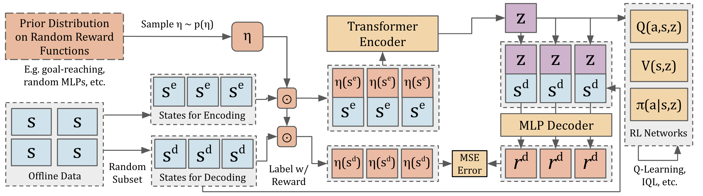

Figure 2. FRE encodes a reward function by evaluating its output over a random set of data states. Given a sampled reward function $\eta$, the reward function is first evaluated on a set of random encoder states from the offline dataset. The $(s, \eta(s))$ pairs are then passed into a permutation-invariant transformer encoder, which produces a latent task embedding $z$. A decoder head is then optimized to minimize the mean-squared error between the true reward and the predicted reward on a set of decoder states. The encoder-decoder structure is trained jointly, and $z$ can be utilized for downstream learning of task-conditioned policies and value functions.
its variational lower bound as follows (Alemi et al., 2016) ${ }^{1}$ :
\[
\begin{aligned}
& I\left(L_{\eta}^{d} ; Z\right)-\beta I\left(L_{\eta}^{e} ; Z\right) \\
= & I\left(L_{\eta}^{d} ; Z\right)-\beta \mathbb{E}\left[D_{\mathrm{KL}}\left(p_{\theta}\left(z \mid L_{\eta}^{e}\right) \| p_{\theta}(z)\right)\right] \\
\geq & I\left(L_{\eta}^{d} ; Z\right)-\beta \mathbb{E}\left[D_{\mathrm{KL}}\left(p_{\theta}\left(z \mid L_{\eta}^{e}\right) \| u(z)\right)\right] \\
\geq & \mathbb{E}_{\eta, L_{\eta}^{e}, L_{\eta}^{d}, z \sim p_{\theta}\left(z \mid L_{\eta}^{e}\right)}\left[\sum_{k=1}^{K^{\prime}} \log q_{\theta}\left(\eta\left(s_{k}^{d}\right) \mid s_{k}^{d}, z\right)\right. \\
& \left.\quad-\beta D_{\mathrm{KL}}\left(p_{\theta}\left(z \mid L_{\eta}^{e}\right) \| u(z)\right)\right]+(\text { const })
\end{aligned}
\]
where we slightly abuse the notation by using $L_{\eta}^{e}$ to denote both the random variable and its realization, such as
$p_{\theta}\left(z \mid L_{\eta}^{e}\right)=p_{\theta}\left(z \mid s_{1}^{e}, \eta\left(s_{1}^{e}\right), s_{2}^{e}, \eta\left(s_{2}^{e}\right), \ldots, s_{K}^{e}, \eta\left(s_{K}^{e}\right)\right)$, and $u(z)$ is an uninformative prior over $z$, which we define as the unit Gaussian. Here, we make use of the fact that $\log q_{\theta}\left(L_{\eta}^{d} \mid z\right)=\sum_{k} \log q_{\theta}\left(s_{k}^{d}, \eta\left(s_{k}^{d}\right) \mid z\right)=$ $\sum_{k} \log q_{\theta}\left(\eta\left(s_{k}^{d}\right) \mid s_{k}^{d}, z\right)+$ (const).

Training an FRE requires two neural networks,
Encoder: $p_{\theta}\left(z \mid s_{1}^{e}, \eta\left(s_{1}^{e}\right), s_{2}^{e}, \eta\left(s_{2}^{e}\right), \ldots, s_{K}^{e}, \eta\left(s_{K}^{e}\right)\right)$,
Decoder: $q_{\theta}\left(\eta\left(s^{d}\right) \mid s^{d}, z\right)$.
which are jointly optimized towards the objective described in Equation 6. FRE therefore learns a minimal latent representation $z$ that is maximally informative about $L_{\eta}$, which may be used in downstream offline RL algorithms.
The FRE method is similar to a denoising auto-encoder (Vincent et al., 2008) trained on $(s, \eta(s))$ pairs sampled from an arbitrary reward function $\eta$ over $s^{e}, s^{d} \sim \mathcal{D}$, as well as that of neural processes (Garnelo et al., 2018b;a; Kim et al., 2019) in that we aim to map a context set of rewardstate pairs to a functional output. The main difference is that

\footnotetext{
${ }^{1}$ We refer to the Appendix B of Alemi et al. (2016) for the full derivation.
}
both denoising auto-encoders and neural processes utilize a determinstic encoder, and we instead use a probabilistic encoder with an information penalty. Additionally, FRE uses a fixed number of samples $K$ while neural processes generally use a variable number.

Practical Implementation. In our experiments, the encoder $p_{\theta}(z \mid \cdot)$ is implemented as a permutation-invariant transformer (Vaswani et al., 2017). $K$ encoder states are sampled uniformly from the offline dataset, then labeled with a scalar reward according to the given reward function $\eta$. The resulting reward is discretized according to magnitude into a learned embedding token space. The reward embeddings and states are then concatenated as input to the transformer. Positional encodings and causal masking are not used, thus the inputs are treated as an unordered set. The average of the final layer representations is used as input to two linear projections which parametrize the mean and standard deviation of Gaussian distribution $p_{\theta}(z \mid \cdot)$.

The decoder $q_{\theta}(\eta(s) \mid s, z)$ is implemented as a feedforward neural network. Crucially, the states sampled for decoding are different than those used for encoding. The encoding network makes use of the entire set of $\left(s_{1 . . K}, \eta\left(s_{1 . . K}\right)\right)$ pairs, whereas the decoder independently predicts the reward for each state, given the shared latent encoding $z$. We train both the encoder and decoder networks jointly, minimizing mean-squared error between the predicted and true rewards under the decoding states.

\subsection*{4.2. Random Functions as a Prior Reward Distribution}

An FRE encoding depends on (1) an offline dataset of trajectories, and (2) a distribution of reward functions. While trajectories are provided, we do not know ahead of time the downstream reward functions. Thus, we aim to craft a relatively uninformative but diverse prior over reward functions.
The specific choice of prior reward distribution is a design
choice. While completely random functions lead to incompressible representations (as per the No Free Lunch theorem (Wolpert \& Macready, 1997)), more structured distributions can lead to robust representations and generalization. Reasonable choices should broadly span the space of possible downstream tasks, while remaining domain-agnostic.

In our implementation, we found that a reasonable yet powerful prior distribution can be constructed from a mixture of random unsupervised functions. The particular mixture we use consists of random singleton functions (corresponding to "goal reaching" rewards), random neural networks (MLPs with two linear layers), and random linear functions (corresponding to "MLPs" with one linear layer). This provides both a degree of structure and a mixture of high frequency (singletons) and low frequency (linear) functions, with the MLPs serving as an intermediate function complexity. A uniform mixture of the three function classes are used during training. We study these choices further in Section 5.3.

If we have privileged knowledge about the downstream tasks, we can adjust the prior reward distribution accordingly, as we will discuss in Section 5.4.

\subsection*{4.3. Offline RL with FRE}

To close the loop on the method, we must learn an FREconditioned policy that maximizes expected return for tasks within the prior reward distribution. Any off-the-shelf RL algorithm can be used for this purpose. The general pipeline is to first sample a reward function $\eta$, encode it into $z$ via the FRE encoder, and optimize $\pi(a \mid s, z)$.

At each training iteration, a batch of state-action pairs $(s, a)$ are selected from the offline dataset. Additionally, a batch of reward functions $\eta$ are also sampled from the prior reward distribution. Each reward function is evaluated on $K$ encoding states from the offline dataset. The resulting $\left(s^{e}, \eta\left(s^{e}\right)\right)$ context pairs are then passed into the FRE encoder to produce a latent representation $z$.

The latent representation $z$ can then be used for RL training. The RL components (Q-function, value function, and policy) are all conditioned on $z$. The sampled reward function $\eta$ is used to calculate rewards during training. A standard Bellman policy improvement step using FRE looks like:
\[
Q(s, a, z) \leftarrow \eta(s)+\mathbb{E}_{s^{\prime} \sim p\left(s^{\prime} \mid s, a\right)}\left[\max _{a^{\prime} \in \mathcal{A}} Q\left(s^{\prime}, a^{\prime}, z\right)\right]
\]

Practical Implementation. In our experiments, we use implicit Q-learning (Kostrikov et al., 2021) as the offline RL method to train our FRE-conditioned policy. This is a widely used offline RL algorithm that avoids querying out-of-distribution actions.

We find that a strided training scheme leads to the most stable performance. In the strided scheme, we first only train
```
Algorithm 1 Functional Reward Encodings (FRE)
    Input: unlabeled offline dataset $\mathcal{D}$, distribution over random
    unsupervised reward functions $p(\eta)$.
    Begin:
    \# Train encoder
    while not converged do
        Sample reward function $\eta \sim p(\eta)$
        Sample $K$ states for encoder $\left\{s_{k}^{e}\right\} \sim \mathcal{D}$
        Sample $K^{\prime}$ states for decoder $\left\{s_{k}^{d}\right\} \sim \mathcal{D}$
        Train FRE by maximizing Equation (6)
    end while
    \# Train policy
    while not converged do
        Sample reward function $\eta \sim p(\eta)$
        Sample $K$ states for encoder $\left\{s_{k}^{e}\right\} \sim \mathcal{D}$
        Encode into latent vector $z \sim p_{\theta}\left(\left\{\left(s_{k}^{e}, \eta\left(s_{k}^{e}\right)\right)\right\}\right)$
        Train $\pi(a \mid s, z), Q(s, a, z), V(s, z)$ using IQL with $r=\eta(s)$
    end while
```
the FRE encoder with gradients from the decoder (Equation (6)). During this time, the RL components are not trained. After the encoder loss converges, we freeze the encoder and then start the training of the RL networks using the frozen encoder's outputs. In this way, we can make the mapping from $\eta$ to $z$ stationary during policy learning, which we found to be important to correctly estimate multitask Q values using TD learning. We summarize our training procedure of FRE in Algorithm 1.

\section*{5. Experiments}

In the following section, we present a series of experiments confirming the effectiveness of FRE as an unsupervised zero-shot RL method. Results are presented on standard offline RL benchmarks: the ExORL benchmark for learning from unsupervised data (Yarats et al., 2022) and variants of the AntMaze and Kitchen environments from D4RL (Fu et al., 2020) adapted for evaluating multi-task and goalconditioned policies. We evaluate on tasks chosen to be representative of the main challenges of each domain, extending the standard tasks whenever possible.
The ExORL dataset is a standard collection of offline data for RL, consisting of trajectories sampled by an exploratory policy on DeepMind Control Suite (Tassa et al., 2018) tasks. We consider the walker and cheetah domains, in accordance with (Touati et al., 2022). To examine zero-shot capabilities, we examine transfer to the standard reward functions consisting of forward/backward velocity, along with goalreaching to random states in the dataset.
AntMaze is a benchmark task where an 8-DoF Ant robot must be maneuvered around a maze. We use the most challenging offline AntMaze dataset from D4RL (Fu et al., 2020) under the antmaze-large-diverse-v2 name. Data trajectories consist of walking paths within the maze. We consider four natural families of tasks: (1) a goal-reaching task where the
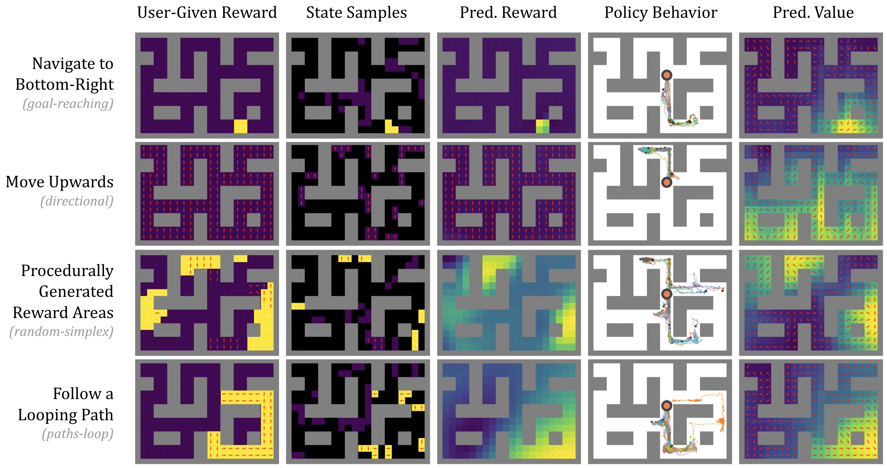

Figure 3. After unsupervised pretraining, FRE can solve user-specified downstream tasks without additional fine-tuning. Shown above are examples of reward functions sampled from various evaluations in AntMaze. Columns: 1) True reward function projected onto maze. 2) Random states used for encoding shown in non-black. 3) Reward predicted by decoder network. 4) Behavior of FRE policy conditioned on latent encoding. Agents start at the red dot. 5) Visualization of predicted value function.
\begin{tabular}{l|llllll}
\hline Eval Task & FRE & FB & SF & GC-IQL & GC-BC & OPAL-10 \\
\hline ant-goal-reaching & $\mathbf{4 8 . 8} \pm \mathbf{6}$ & $0.0 \pm 0$ & $0.4 \pm 2$ & $\mathbf{4 0 . 0} \pm \mathbf{1 4}$ & $12.0 \pm 18$ & $19.4 \pm 12$ \\
ant-directional & $\mathbf{5 5 . 2} \pm \mathbf{8}$ & $4.8 \pm 14$ & $6.5 \pm 16$ & - & - & $39.4 \pm 13$ \\
ant-random-simplex & $\mathbf{2 1 . 3} \pm \mathbf{4}$ & $9.7 \pm 2$ & $8.5 \pm 10$ & - & - & $\mathbf{2 7 . 3} \pm \mathbf{8}$ \\
ant-path-loop & $\mathbf{6 7 . 2} \pm \mathbf{3 6}$ & $46.6 \pm 40$ & $13.6 \pm 16$ & - & - & $44.4 \pm 22$ \\
ant-path-edges & $60.0 \pm 17$ & $23.5 \pm 25$ & $2.2 \pm 5$ & - & - & $\mathbf{8 5 . 0} \pm \mathbf{1 0}$ \\
ant-path-center & $\mathbf{6 4 . 4} \pm \mathbf{3 8}$ & $\mathbf{7 0 . 3} \pm \mathbf{3 7}$ & $39.4 \pm 27$ & - & - & $58.1 \pm 36$ \\
\hline antmaze-all & $\mathbf{5 2 . 8} \pm \mathbf{1 8 . 2}$ & $25.8 \pm 19.8$ & $11.8 \pm 12.6$ & - & - & $45.6 \pm 17.0$ \\
\hline exorl-walker-goals & $\mathbf{9 4} \pm \mathbf{2}$ & $58 \pm 30$ & $\mathbf{1 0 0} \pm \mathbf{0}$ & $\mathbf{9 2} \pm \mathbf{4}$ & $52 \pm 18$ & $\mathbf{8 8} \pm \mathbf{8}$ \\
exorl-cheetah-goals & $58 \pm 8$ & $1 \pm 2$ & $0 \pm 0$ & $\mathbf{1 0 0} \pm \mathbf{0}$ & $14 \pm 6$ & $0 \pm 0$ \\
exorl-walker-velocity & $34 \pm 13$ & $\mathbf{6 4} \pm \mathbf{1}$ & $38 \pm 4$ & - & - & $8 \pm 0$ \\
exorl-cheetah-velocity & $20 \pm 2$ & $\mathbf{5 1} \pm \mathbf{3}$ & $25 \pm 3$ & - & - & $17 \pm 8$ \\
\hline exorl-all & $\mathbf{5 1 . 5} \pm \mathbf{6 . 3}$ & $43.4 \pm 9.1$ & $40.9 \pm 1.9$ & - & - & $28.2 \pm 4.0$ \\
\hline kitchen & $\mathbf{6 6} \pm \mathbf{3}$ & $3 \pm 6$ & $1 \pm 1$ & $\mathbf{5 9} \pm \mathbf{4}$ & $35 \pm 9$ & $26 \pm 16$ \\
\hline \hline all & $\mathbf{5 7} \pm \mathbf{9}$ & $24 \pm 12$ & $18 \pm 5$ & - & - & $33 \pm 12$ \\
\hline
\end{tabular}

Table 1. Offline zero-shot RL comparisons on AntMaze, ExORL, and Kitchen. FRE-conditioned policies match or outperform state-of-the-art prior methods on many standard evaluation objectives including goal-reaching, directional movement, and structured locomotion paths. FRE utilizes only 32 examples of (state, reward) pairs during evaluation, while the FB and SF methods require 5120 examples to be consistent with prior work. Results are normalized between 0 and 100.
${ }^{1}$ OPAL is a skill discovery method and does not have zero-shot capabilities. Thus, we compare to a privileged version where the agent evaluates 10 skills in the downstream task with online rollouts, and selects the one with the highest performance.
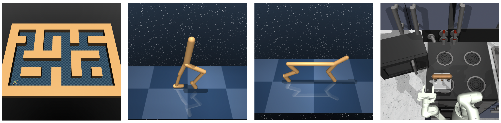

Figure 4. Evaluation domains: AntMaze, ExORL, and Kitchen.
robot must navigate to various locations in the maze, (2) a directional task which involves moving in a given $(x, y)$ direction, (3) a random-simplex task which assigns reward based on a procedural noise generator, and (4) a set of three handdesigned path tasks involving navigating to the edges of the map, moving in a loop, and following a central corridor.

Kitchen is a D4RL environment where a robot hand must accomplish various objectives in an interactive environment (opening a microwave, flipping a light switch, etc.). To extend Kitchen into a multi-task setting, we evaluate on reward functions corresponding to each of the 7 standard subtasks in the environment.

Prior Reward Distribution. We utilize the same prior reward distribution for training FRE agents on each domain. Specifically, we consider a mixture of three random unsupervised function types, each with progressively higher complexity. The first are singleton goal-reaching rewards corresponding to a reward of -1 for every timestep where the goal has not been reached, and 0 otherwise. Goals are sampled randomly from the dataset. The second are random linear functions, defined as the inner product between a uniformly random vector and the current state. We find that biasing towards simple functions is a useful prior, which can be achieved via a sparse mask over the vector. The final family is random MLPs, which are implemented as random initializations of 2-layer MLPs. MLPs with sufficient size are universal function approximators (Hornik et al., 1989), thus this family broadly covers possible downstream rewards.

\subsection*{5.1. Do FRE encodings trained on random reward functions zero-shot transfer to unseen test tasks?}

Figure 3 illustrates how FRE generalizes from samples of randomly-annotated AntMaze states, both in terms of the decoded reward and the resulting policy and estimated value function. In all cases, the value function correctly captures the approximate expected returns from each position. The executed policy generally maximizes the value function, although some trajectories fail when encountering out-ofdistribution states, which is a common challenge in offline RL (Kumar et al., 2020). Thus, we can conclude that FRE encodings present a simple yet reasonable way of solving downstream tasks without additional training.
\begin{tabular}{l|ccccc}
\hline & FRE & FB & SF & GCRL & OPAL \\
\hline Zero-Shot & $\checkmark$ & $\checkmark$ & $\checkmark$ & $\checkmark$ & $x$ \\
Any Reward Func. & $\checkmark$ & $\checkmark$ & $x$ & $x$ & $x$ \\
No Linear Constraint & $\checkmark$ & $x$ & $x$ & $\checkmark$ & $\checkmark$ \\
Learns Optimal Policies & $\checkmark$ & $\checkmark$ & $\checkmark$ & $\checkmark$ & $x$ \\
\hline
\end{tabular}

Table 2. FRE unifies prior methods in capabilities. OPAL does not have zero-shot capabilities and learns via BC rather than Qlearning. GCRL and SF both limit reward function families to goal-reaching or linear functions, respectively. FB can learn to solve any reward function, but requires a linearized value function.

\subsection*{5.2. How does FRE perform on zero-shot offline RL benchmarks, compared to prior methods?}

We now examine the performance of our FRE agent on new downstream tasks, and compare with state-of-the-art prior methods in unsupervised RL. The comparisons include:
- FRE, our method.
- Forward-Backward (FB) method (Touati \& Ollivier, 2021), a state-of-the-art zero-shot RL method that jointly learns a pair of representations that represent a family of tasks and their optimal policies.
- Successor Features (SF) (Barreto et al., 2017; Borsa et al., 2018), which utilize a set of pre-trained features to approximate a universal family of reward functions and their corresponding policies.
- Goal-Conditioned IQL (GC-IQL) (Kostrikov et al., 2021), a representative goal-conditioned RL method. GCIQL is a variant of IQL that uses hindsight relabeling to learn goal-reaching policies.
- Goal-Conditioned Behavioral Cloning (GC-BC), a simple offline RL method that learns goal-reaching policies by mimicking trajectories that reach goals in the dataset.
- OPAL (Ajay et al., 2020), a representative offline unsupervised skill discovery method where latent skills are learned by auto-encoding trajectories.

All methods are evaluated using a mean over twenty evaluation episodes, and each agent is trained using five random seeds, with the standard deviation across seeds shown. FRE, GC-IQL, and GC-BC are implemented within the same codebase and with the same network structure. FB and SF are based on DDPG-based policies, and are run via the code provided from (Touati et al., 2022). For the SF comparisons, we follow prior work (Touati et al., 2022) and learn features using ICM (Pathak et al., 2017), which is reported to be the strongest method in the ExORL Walker and Cheetah tasks (Touati et al., 2022). OPAL is re-implemented in our codebase.

Table 1 shows that FRE matches or outperforms state-of-the-art baselines on AntMaze and the ExORL benchmark.
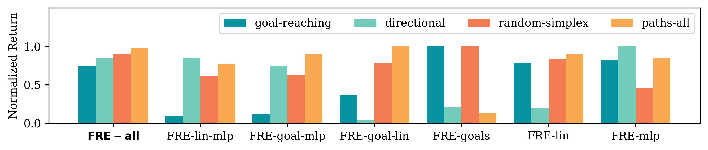

Figure 5. The general capabilities of a FRE agent scales with diversity of random functions used in training. FRE-all represents an agent trained on a uniform mixture of three random reward families, while each other column represents a specific agent trained on only a subset of the three. The robust FRE-all agent displays the largest total score, and competitive performance among all evaluation tasks, showing that the FRE encoding can combine reward function distributions without losing performance.

Especially on goal-reaching tasks, the FRE agent is able to considerably outperform SF-based baselines, and matches goal-specific RL methods. The same FRE agent is able to solve a variety of other tasks, such as directional movement, random simplex rewards, and unique test tasks. Thus FRE is shown to be a competitive method for simple zero-shot unsupervised RL.

Similarly to FRE, FB and SF train a universal agent that maximizes unsupervised reward functions. They rely on linearized value functions to achieve generalization, whereas FRE learns a shared latent space through modeling a reward distribution. Note that FB/SF rely on linear regression to perform test time adaptation, whereas FRE uses a learned encoder network. To be consistent with prior methodology, we give these methods 5120 reward samples during evaluation time (in comparison to only 32 for FRE). Even with considerably fewer samples, FRE is competitive with a strong FB method across the board, and greatly outperforms on goalreaching, ant-directional, and kitchen. OPAL is considered as an offline unsupervised skill discovery method that also learns from offline data. Since OPAL does not solve the problem of understanding a reward function zero-shot, we compare to a version with privileged execution based on online rollouts. Despite OPAL's use of privileged online rollouts, however, the results suggest that FRE outperforms OPAL in general, often by a significant margin.

\subsection*{5.3. What are the scaling properties of FRE as the space of random rewards increases?}

One desirable property of FRE is that disparate reward families can be jointly encoded. We examine if encoding combinations of random reward families lead to stronger performance (due to generalization) or weaker performance (due to limited network capacity, forgetting, etc). We train FRE agents on all possible subsets of the random reward forms. All agents are given the same training budget, e.g. FRE-all has a third of the goal-reaching tasks of FRE-goals.

Table 4 highlights that the FRE-all agent trained on all reward types displays the highest total score, and competitive
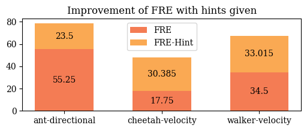

Figure 6. By augmenting the random reward families with specific reward distributions, FRE can utilize domain knowledge without algorithmic changes.
performance among all evaluation tasks. This result suggests that the performance of FRE scales smoothly as we use more diverse types of rewards, thanks to our scalable architecture for the permutation-invariant encoder.

\subsection*{5.4. Can prior domain knowledge be used to increase the specificity of the FRE encoding?}

Oftentimes, some information is known about the distribution of downstream tasks beforehand. FRE can straightforwardly utilize this info by augmenting the prior reward functions with a more specific form, e.g. random functions that depend only on XY positions or velocity.

Figure 6 highlights the universality of FRE by utilizing it asis as a multi-task RL method, where policies are optimized over known task distributions. No changes to the neural network architecture or algorithm are necessary. Thus FRE has an advantage in generality over multi-task methods such as GCRL which are limited to a specific form of task. FRE allows us to bypass the need for domain-specific task labeling, as approximate latent encodings of each task are learned in a unsupervised manner.

\section*{6. Discussion}

This work describes a general unsupervised method for use in zero-shot offline reinforcement learning. We first introduce a functional encoding for reward functions, allowing us to learn a universal latent representation of tasks. When trained over only random reward functions, FREconditioned policies are able to generalize to novel down-
stream rewards. FRE displays competetive performance on goal-reaching and multi-task unsupervised settings, using a single agent.

Limitations. While FRE provides a flexible and nonlinear policy inference for new tasks, it relies on a hand-specified prior reward distribution. Our specific reward distribution is relatively simple, consists of a mixture of various random functions. However, this choice is somewhat ad hoc, and while we empirically observe that it works well for many benchmark tasks, it remains unclear if there is an optimal and general choice of reward priors. The formulation presented in this work requires offline data, and extending FRE to the online setting is a promising direction for future work.

Generalist agents pretrained in an unsupervised way can enable rapid acquisition of diverse tasks, and FRE provides a step toward training such generalist agents from unsupervised, non-expert offline data. We hope that this will lead to a range of exciting future work that could address acquisition of skill spaces from more diverse data sources (e.g., in robotics, with videos, etc.), further improve the generalization ability of such agents to even more varied downstream tasks, as well as works that provide a deeper theoretical understanding of reward priors and guarantees on downstream task performance, all without the need to hand-specify reward functions or task descriptions during pretraining.

\section*{Acknowledgements}

This work was supported in part by an NSF Fellowship for KF. This research used the Savio computational cluster resource provided by the Berkeley Research Computing program at UC Berkeley.

\section*{Impact Statement}

This paper presents work whose goal is to advance the field of Machine Learning. There are many potential societal consequences of our work, none of which we feel must be specifically highlighted here.

\section*{References}

Agarwal, S., Durugkar, I., Stone, P., and Zhang, A. $f$-policy gradients: A general framework for goal conditioned rl using $f$-divergences. arXiv preprint arXiv:2310.06794, 2023.

Ajay, A., Kumar, A., Agrawal, P., Levine, S., and Nachum, O. Opal: Offline primitive discovery for accelerating offline reinforcement learning. arXiv preprint arXiv:2010.13611, 2020.

Alemi, A. A., Fischer, I., Dillon, J. V., and Murphy, K.

Deep variational information bottleneck. arXiv preprint arXiv:1612.00410, 2016.

Andreas, J., Klein, D., and Levine, S. Modular multitask reinforcement learning with policy sketches. In International conference on machine learning, pp. 166-175. PMLR, 2017.

Andrychowicz, M., Wolski, F., Ray, A., Schneider, J., Fong, R., Welinder, P., McGrew, B., Tobin, J., Pieter Abbeel, O., and Zaremba, W. Hindsight experience replay. Advances in neural information processing systems, 30, 2017.

Barreto, A., Dabney, W., Munos, R., Hunt, J. J., Schaul, T., van Hasselt, H. P., and Silver, D. Successor features for transfer in reinforcement learning. Advances in neural information processing systems, 30, 2017.

Borsa, D., Barreto, A., Quan, J., Mankowitz, D., Munos, R., Van Hasselt, H., Silver, D., and Schaul, T. Universal successor features approximators. arXiv preprint arXiv:1812.07626, 2018.

Brown, T., Mann, B., Ryder, N., Subbiah, M., Kaplan, J. D., Dhariwal, P., Neelakantan, A., Shyam, P., Sastry, G., Askell, A., et al. Language models are few-shot learners. Advances in neural information processing systems, 33: 1877-1901, 2020.

Caruana, R. Multitask learning. Machine learning, 28:4175, 1997.

Chebotar, Y., Hausman, K., Lu, Y., Xiao, T., Kalashnikov, D., Varley, J., Irpan, A., Eysenbach, B., Julian, R., Finn, C., et al. Actionable models: Unsupervised offline reinforcement learning of robotic skills. arXiv preprint arXiv:2104.07749, 2021.

Chen, B., Zhu, C., Agrawal, P., Zhang, K., and Gupta, A. Self-supervised reinforcement learning that transfers using random features. arXiv preprint arXiv:2305.17250, 2023.

Dayan, P. Improving generalization for temporal difference learning: The successor representation. Neural computation, 5(4):613-624, 1993.

Dorfman, R., Shenfeld, I., and Tamar, A. Offline meta reinforcement learning-identifiability challenges and effective data collection strategies. Advances in Neural Information Processing Systems, 34:4607-4618, 2021.

Duan, Y., Schulman, J., Chen, X., Bartlett, P. L., Sutskever, I., and Abbeel, P. $\mathrm{Rl}^{2}$ : Fast reinforcement learning via slow reinforcement learning. arXiv preprint arXiv:1611.02779, 2016.

Durugkar, I., Tec, M., Niekum, S., and Stone, P. Adversarial intrinsic motivation for reinforcement learning. Advances in Neural Information Processing Systems, 34: 8622-8636, 2021.

Eysenbach, B., Gupta, A., Ibarz, J., and Levine, S. Diversity is all you need: Learning skills without a reward function. arXiv preprint arXiv:1802.06070, 2018.

Eysenbach, B., Zhang, T., Levine, S., and Salakhutdinov, R. R. Contrastive learning as goal-conditioned reinforcement learning. Advances in Neural Information Processing Systems, 35:35603-35620, 2022.

Fang, M., Zhou, C., Shi, B., Gong, B., Xu, J., and Zhang, T. Dher: Hindsight experience replay for dynamic goals. In International Conference on Learning Representations, 2018.

Fu, J., Kumar, A., Nachum, O., Tucker, G., and Levine, S. D4rl: Datasets for deep data-driven reinforcement learning. arXiv preprint arXiv:2004.07219, 2020.

Garnelo, M., Rosenbaum, D., Maddison, C., Ramalho, T., Saxton, D., Shanahan, M., Teh, Y. W., Rezende, D., and Eslami, S. A. Conditional neural processes. In International conference on machine learning, pp. 1704-1713. PMLR, 2018a.

Garnelo, M., Schwarz, J., Rosenbaum, D., Viola, F., Rezende, D. J., Eslami, S., and Teh, Y. W. Neural processes. arXiv preprint arXiv:1807.01622, 2018b.

Hallak, A., Di Castro, D., and Mannor, S. Contextual markov decision processes. arXiv preprint arXiv:1502.02259, 2015.

Hornik, K., Stinchcombe, M., and White, H. Multilayer feedforward networks are universal approximators. Neural networks, 2(5):359-366, 1989.

Hu, H., Yang, Y., Ye, J., Mai, Z., and Zhang, C. Unsupervised behavior extraction via random intent priors. arXiv preprint arXiv:2310.18687, 2023.

Kaelbling, L. P. Learning to achieve goals. In IJCAI, volume 2, pp. 1094-8. Citeseer, 1993.

Kim, H., Mnih, A., Schwarz, J., Garnelo, M., Eslami, A., Rosenbaum, D., Vinyals, O., and Teh, Y. W. Attentive neural processes. arXiv preprint arXiv:1901.05761, 2019.

Kirillov, A., Mintun, E., Ravi, N., Mao, H., Rolland, C., Gustafson, L., Xiao, T., Whitehead, S., Berg, A. C., Lo, W.-Y., et al. Segment anything. arXiv preprint arXiv:2304.02643, 2023.

Kostrikov, I., Nair, A., and Levine, S. Offline reinforcement learning with implicit q-learning. arXiv preprint arXiv:2110.06169, 2021.

Kumar, A., Zhou, A., Tucker, G., and Levine, S. Conservative q-learning for offline reinforcement learning. Advances in Neural Information Processing Systems, 33: 1179-1191, 2020.

Laskin, M., Liu, H., Peng, X. B., Yarats, D., Rajeswaran, A., and Abbeel, P. Cic: Contrastive intrinsic control for unsupervised skill discovery. arXiv preprint arXiv:2202.00161, 2022.

Levy, A., Konidaris, G., Platt, R., and Saenko, K. Learning multi-level hierarchies with hindsight. arXiv preprint arXiv:1712.00948, 2017.

Li, A., Pinto, L., and Abbeel, P. Generalized hindsight for reinforcement learning. Advances in neural information processing systems, 33:7754-7767, 2020a.

Li, J., Vuong, Q., Liu, S., Liu, M., Ciosek, K., Christensen, H., and $\mathrm{Su}, \mathrm{H}$. Multi-task batch reinforcement learning with metric learning. Advances in Neural Information Processing Systems, 33:6197-6210, 2020b.

Li, J., Tang, C., Tomizuka, M., and Zhan, W. Hierarchical planning through goal-conditioned offline reinforcement learning. IEEE Robotics and Automation Letters, 7(4): 10216-10223, 2022.

Li, L., Yang, R., and Luo, D. Focal: Efficient fullyoffline meta-reinforcement learning via distance metric learning and behavior regularization. arXiv preprint arXiv:2010.01112, 2020c.

Nair, A. V., Pong, V., Dalal, M., Bahl, S., Lin, S., and Levine, S. Visual reinforcement learning with imagined goals. Advances in neural information processing systems, 31, 2018.

Park, S., Ghosh, D., Eysenbach, B., and Levine, S. Hiql: Offline goal-conditioned rl with latent states as actions. arXiv preprint arXiv:2307.11949, 2023a.

Park, S., Rybkin, O., and Levine, S. Metra: Scalable unsupervised rl with metric-aware abstraction. arXiv preprint arXiv:2310.08887, 2023b.

Pathak, D., Agrawal, P., Efros, A. A., and Darrell, T. Curiosity-driven exploration by self-supervised prediction. In International conference on machine learning, pp. 2778-2787. PMLR, 2017.

Pertsch, K., Lee, Y., and Lim, J. Accelerating reinforcement learning with learned skill priors. In Conference on robot learning, pp. 188-204. PMLR, 2021.

Pong, V. H., Nair, A. V., Smith, L. M., Huang, C., and Levine, S. Offline meta-reinforcement learning with online self-supervision. In International Conference on Machine Learning, pp. 17811-17829. PMLR, 2022.

Rakelly, K., Zhou, A., Finn, C., Levine, S., and Quillen, D. Efficient off-policy meta-reinforcement learning via probabilistic context variables. In International conference on machine learning, pp. 5331-5340. PMLR, 2019.

Savinov, N., Dosovitskiy, A., and Koltun, V. Semiparametric topological memory for navigation. arXiv preprint arXiv:1803.00653, 2018.

Schaul, T., Horgan, D., Gregor, K., and Silver, D. Universal value function approximators. In International conference on machine learning, pp. 1312-1320. PMLR, 2015.

Sharma, A., Gu, S., Levine, S., Kumar, V., and Hausman, K. Dynamics-aware unsupervised discovery of skills. arXiv preprint arXiv:1907.01657, 2019.

Shridhar, M., Manuelli, L., and Fox, D. Perceiver-actor: A multi-task transformer for robotic manipulation. In Conference on Robot Learning, pp. 785-799. PMLR, 2023.

Silva, A., Moorman, N., Silva, W., Zaidi, Z., Gopalan, N., and Gombolay, M. Lancon-learn: Learning with language to enable generalization in multi-task manipulation. IEEE Robotics and Automation Letters, 7(2):1635-1642, 2021.

Sodhani, S., Zhang, A., and Pineau, J. Multi-task reinforcement learning with context-based representations. In International Conference on Machine Learning, pp. 97679779. PMLR, 2021.

Strouse, D., Baumli, K., Warde-Farley, D., Mnih, V., and Hansen, S. Learning more skills through optimistic exploration. arXiv preprint arXiv:2107.14226, 2021.

Tassa, Y., Doron, Y., Muldal, A., Erez, T., Li, Y., Casas, D. d. L., Budden, D., Abdolmaleki, A., Merel, J., Lefrancq, A., et al. Deepmind control suite. arXiv preprint arXiv:1801.00690, 2018.

Tishby, N., Pereira, F. C., and Bialek, W. The information bottleneck method. arXiv preprint physics/0004057, 2000.

Touati, A. and Ollivier, Y. Learning one representation to optimize all rewards. Advances in Neural Information Processing Systems, 34:13-23, 2021.

Touati, A., Rapin, J., and Ollivier, Y. Does zeroshot reinforcement learning exist? arXiv preprint arXiv:2209.14935, 2022.

Vaswani, A., Shazeer, N., Parmar, N., Uszkoreit, J., Jones, L., Gomez, A. N., Kaiser, Ł., and Polosukhin, I. Attention is all you need. Advances in neural information processing systems, 30, 2017.

Vincent, P., Larochelle, H., Bengio, Y., and Manzagol, P.-A. Extracting and composing robust features with denoising autoencoders. In Proceedings of the 25th international conference on Machine learning, pp. 1096-1103, 2008.

Wang, T., Torralba, A., Isola, P., and Zhang, A. Optimal goal-reaching reinforcement learning via quasimetric learning. arXiv preprint arXiv:2304.01203, 2023.

Wolpert, D. H. and Macready, W. G. No free lunch theorems for optimization. IEEE transactions on evolutionary computation, 1(1):67-82, 1997.

Yang, R., Lu, Y., Li, W., Sun, H., Fang, M., Du, Y., Li, X., Han, L., and Zhang, C. Rethinking goal-conditioned supervised learning and its connection to offline rl. arXiv preprint arXiv:2202.04478, 2022.

Yarats, D., Brandfonbrener, D., Liu, H., Laskin, M., Abbeel, P., Lazaric, A., and Pinto, L. Don't change the algorithm, change the data: Exploratory data for offline reinforcement learning. arXiv preprint arXiv:2201.13425, 2022.

Yuan, H. and $\mathrm{Lu}, \mathrm{Z}$. Robust task representations for offline meta-reinforcement learning via contrastive learning. In International Conference on Machine Learning, pp. 25747-25759. PMLR, 2022.

\section*{A. Hyperparameters}
\begin{tabular}{l|l}
\hline Batch Size & 512 \\
Encoder Training Steps & 150,000 (1M for ExORL/Kitchen) \\
Policy Training Steps & 850,000 (1M for ExORL/Kitchen) \\
Reward Pairs to Encode & 32 \\
Reward Pairs to Decode & 8 \\
\hline Ratio of Goal-Reaching Rewards & 0.33 \\
Ratio of Linear Rewards & 0.33 \\
Ratio of Randomm MLP Rewards & 0.33 \\
\hline Number of Reward Embeddings & 32 \\
Reward Embedding Dim & 128 \\
\hline Optimizer & Adam \\
Learning Rate & 0.0001 \\
RL Network Layers & {$[512,512,512]$} \\
Decoder Network Layers & {$[512,512,512]$} \\
Encoder Layers & {$[256,256,256,256]$} \\
Encoder Attention Heads & 4 \\
$\beta$ KL Weight & 0.01 \\
Target Update Rate & 0.001 \\
Discount Factor & 0.88 \\
AWR Temperature & 3.0 \\
IQL Expectile & 0.8 \\
\hline
\end{tabular}

Table 3. Hyperparameters used for FRE.

\section*{B. Training Details}

Random goal-reaching functions are generated by sampling random goals from the offline dataset. Specifically we utilize a hindsight experience relabelling (Andrychowicz et al., 2017) distribution in accordance with (Park et al., 2023a). Given a random selected state, we utilize this state as the goal with a 0.2 chance, a future state within the trajectory with a 0.5 chance, and a completely random state with a 0.3 chance. Reward is set to -1 for every timestep that the goal is not achieved. A done mask is set to True when the goal is achieved. We ensure that at least one of the samples contains the goal state during the encoding process.
Random Linear functions are generated according to a uniform vector within -1 and 1. On AntMaze, we remove the XY positions from this generation as the scale of the dimensions led to instability. A random binary mask is applied with a 0.9 chance to zero the vector at that dimension, to encourage sparsity and bias towards simpler functions.

Random MLP functions are generated using a neural network of size (state_dim, 32, 1). Parameters are sampled using a normal distribution scaled by the average dimension of the layer. A tanh activation is used between the two layers. The final output of the neural network is clipped between -1 and 1 .

\section*{C. Environment Details}

\section*{C.1. AntMaze}

We utilize the antmaze-large-diverse-v2 dataset from D4RL (Fu et al., 2020). Online evaluation is performed with a length of 2000 timesteps. The ant robot is placed in the center of the maze to allow for more diverse behavior, in comparison to the original start position in the bottom-left.

For the goal-reaching tasks, we utilize a reward function that considers the goal reached if an agent reaches within a distance of 2 with the target position. The FRE, GC-IQL, GC-BC, and OPAL agents all utilize a discretized preprocessing procedure, where the X and Y coordinates are discretized into 32 bins.

\section*{C.2. ExORL}

We utilize cheetah-run, cheetah-walk, cheetah-run-backwards, cheetah-walk-backwards and walker-run, walker-walk as evaluation tasks. Agents are evaluated for 1000 timesteps. For goal-reaching tasks, we select five consistent goal states from the offline dataset.

FRE assumes that reward functions must be pure functions of the environment state. Because the Cheetah and Walker environments utilize rewards that are a function of the underlying physics, we append information about the physics onto the offline dataset during encoder training. Specifically, we append the values of
```
self.physics.horizontal_velocity()
self.physics.torso_upright()
self.physics.torso_height()
```
to Walker, and
```
self.physics.speed()
```
to Cheetah.
The above auxiliary information is neccessary only for the encoder network, in order to define the true reward functions of the ExORL tasks, which are based on physics states. We found that performance was not greatly affected whether or not the value functions and policy networks have access to the auxilliary information, and are instead trained on the underlying observation space of the environment.

Goals in ExORL are computed when the Euclidean distance between the current state and the goal state is less than 0.1 . Each state dimension is normalized according to the standard deviation along that dimension within the offline dataset. Augmented information is not utilized when calculating goal distance.

\section*{C.3. Kitchen}

For the Kitchen evaluation tasks, we utilize the seven standard subtasks within the D4RL Kitchen environment. Because each task already defines a sparse reward, we directly use those sparse rewards as evaluation tasks.

\section*{D. Extended Results}
\begin{tabular}{l|lllllll}
\hline Eval Task & FRE-all & FRE-goals & FRE-lin & FRE-mlp & FRE-lin-mlp & FRE-goal-mlp & FRE goal-lin \\
\hline goal-reaching & $\mathbf{4 8 . 8} \pm \mathbf{6}$ & $\mathbf{6 6 . 0} \pm \mathbf{4}$ & $6.0 \pm 1$ & $24.0 \pm 6$ & $8.0 \pm 4$ & $\mathbf{5 2 . 0} \pm \mathbf{6}$ & $\mathbf{5 4 . 0} \pm \mathbf{1 2}$ \\
directional & $\mathbf{5 5 . 2} \pm \mathbf{8}$ & $6.6 \pm 13$ & $\mathbf{5 5 . 5} \pm \mathbf{6}$ & $-6.6 \pm 14$ & $47.9 \pm 6$ & $5.1 \pm 25$ & $\mathbf{6 7 . 1} \pm \mathbf{5}$ \\
random-simplex & $\mathbf{2 1 . 3} \pm \mathbf{4}$ & $\mathbf{2 3 . 5} \pm \mathbf{6}$ & $14.4 \pm 3$ & $\mathbf{1 8 . 5} \pm \mathbf{6}$ & $14.8 \pm 4$ & $\mathbf{1 9 . 7} \pm \mathbf{5}$ & $10.7 \pm 3$ \\
path-all & $\mathbf{6 3 . 8} \pm \mathbf{1 0}$ & $8.3 \pm 11$ & $50.5 \pm 9$ & $\mathbf{6 5 . 4} \pm \mathbf{5}$ & $58.5 \pm 7$ & $58.6 \pm 23$ & $55.8 \pm 8$ \\
\hline total & $\mathbf{4 7 . 3} \pm \mathbf{7}$ & $26.1 \pm 8$ & $31.6 \pm 5$ & $25.3 \pm 8$ & $32.3 \pm 5$ & $33.8 \pm 15$ & $46.9 \pm 7$ \\
\hline
\end{tabular}

Table 4. Full results comparing FRE agents trained on different subsets of random reward functions in AntMaze.
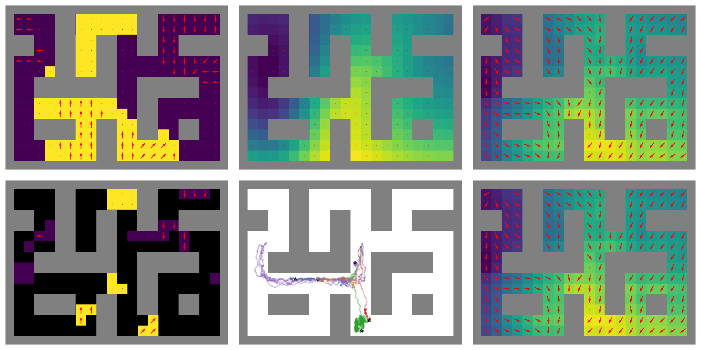
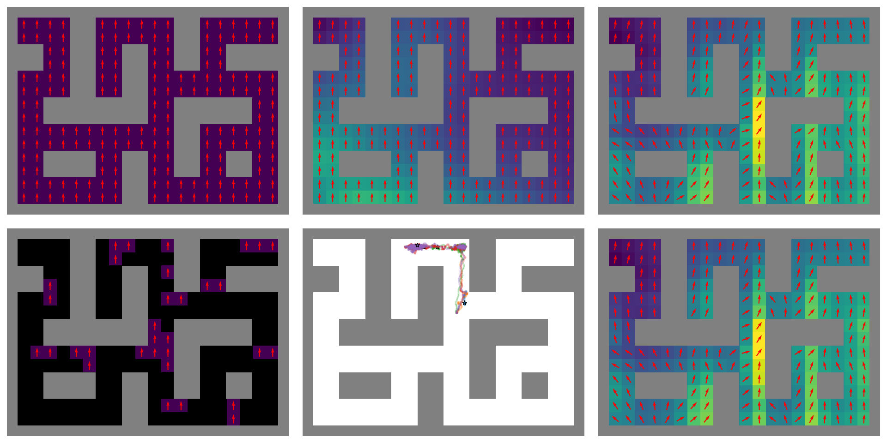
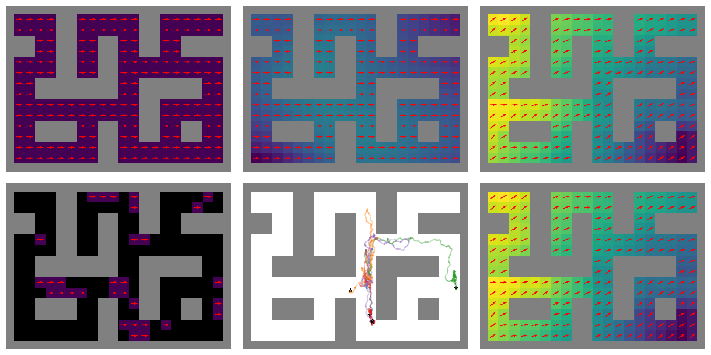

Figure 7. Additional examples of FRE results on AntMaze. Arranged three examples per page. For each run, from top-left to bottom-right: True reward function, predicted reward, Q function 1, randomly sampled states for encoding, policy trajectory, Q function 2.
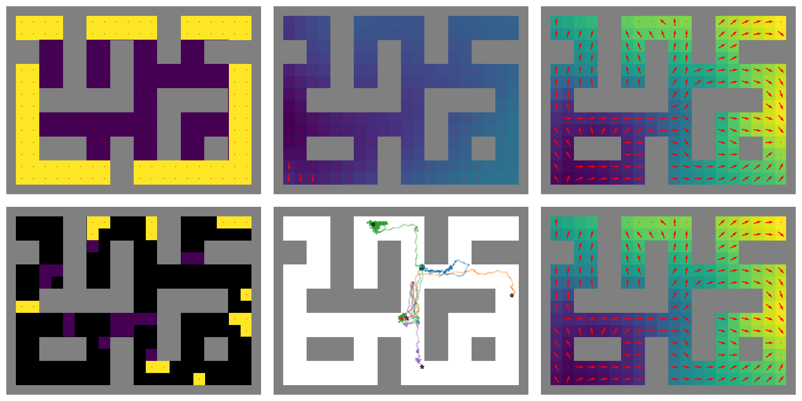
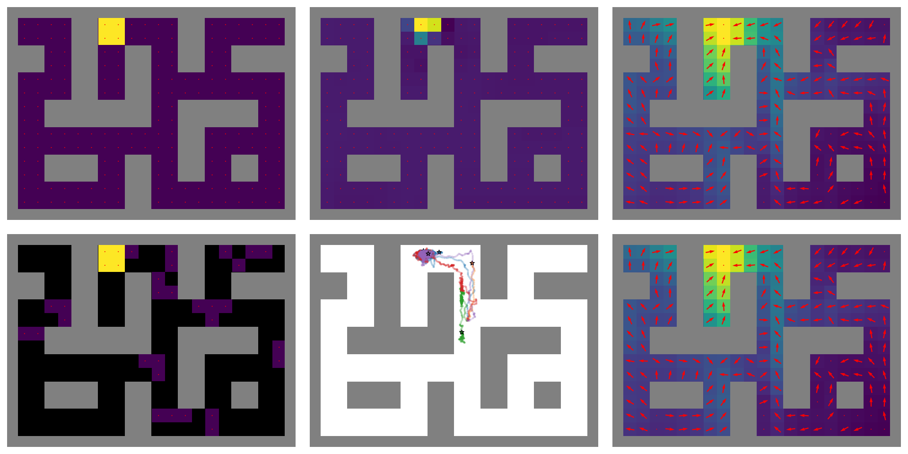
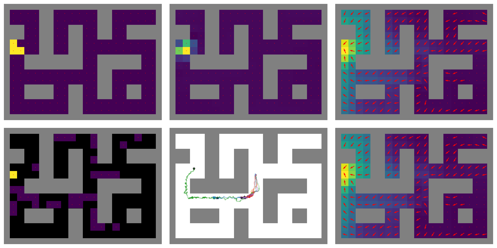

Figure 8. Additional examples of FRE results on AntMaze. Arranged three examples per page. For each run, from top-left to bottom-right: True reward function, predicted reward, Q function 1, randomly sampled states for encoding, policy trajectory, Q function 2.
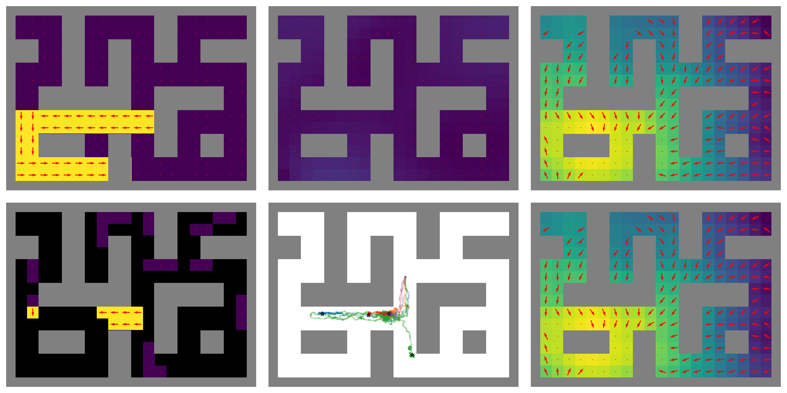
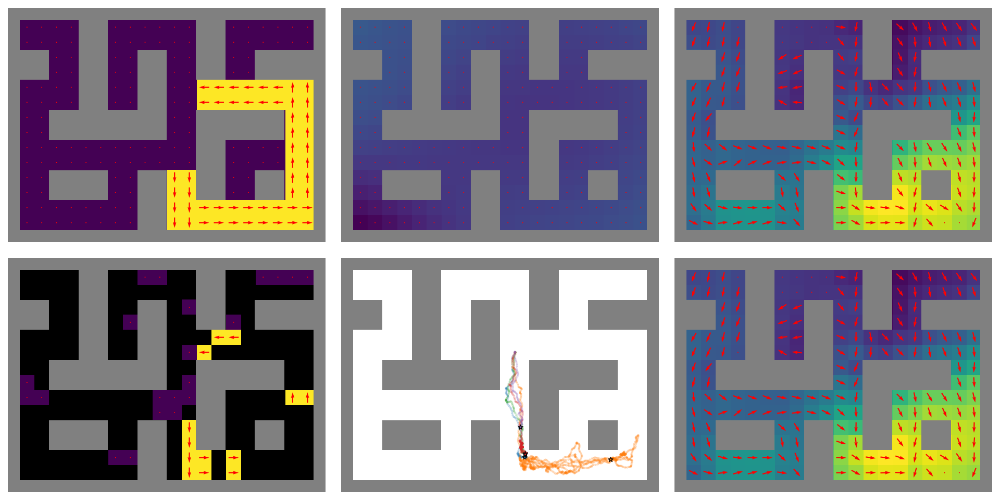


Figure 9. Additional examples of FRE results on AntMaze. Arranged three examples per page. For each run, from top-left to bottom-right: True reward function, predicted reward, Q function 1, randomly sampled states for encoding, policy trajectory, Q function 2.
